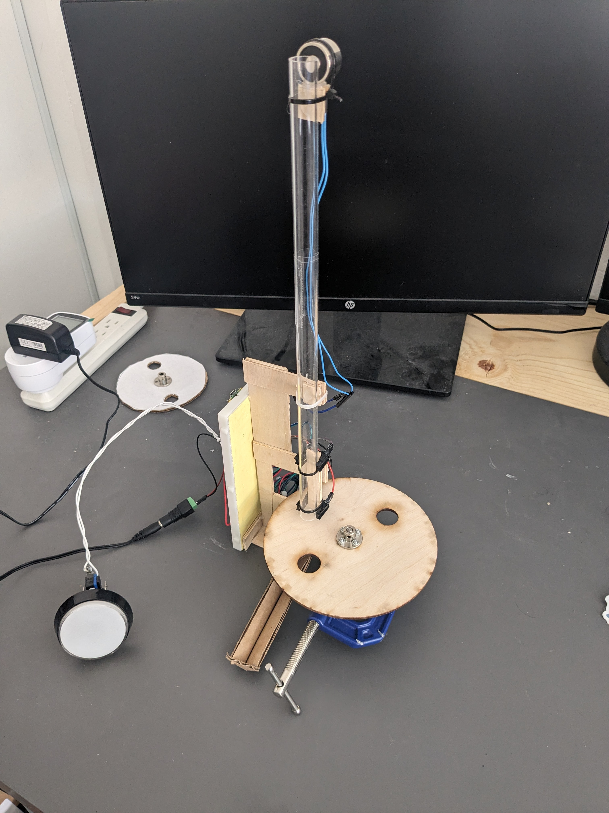
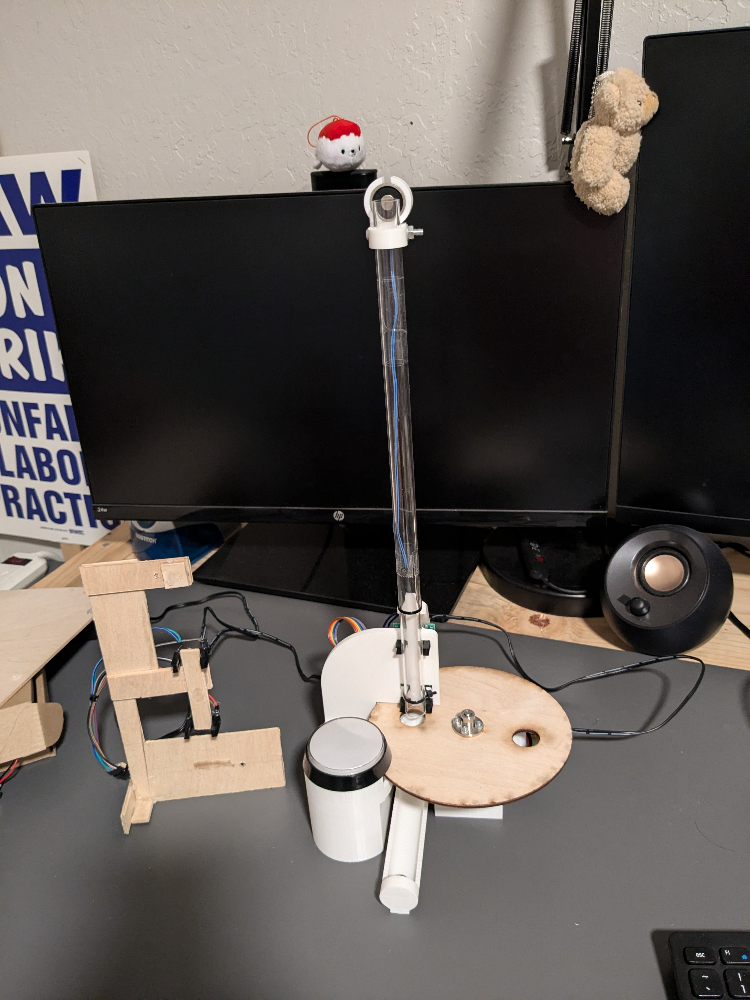

# Construction of the Tunneling Ball Demonstration

The tunneling ball demonstration mainly consists of a rapidly spinning disk, and a small bearing ball that drops through a small hole in the disk. The point of this demonstration is to precisely time the movement of the disk
such that the ball can fall through; a successful "tunnel" shows the timing capabilities of the system.

Top image: first version of the demonstration. The frame is made of scraps of 1/8th inch thick plywood, and the motor is clamped to the frame. The breadboard is a structural element.

Bottom image: second version of the demonstration, with a 3d printed frame. The breadboard is no longer a structural element and is behind the frame.

## Contents

A list of components/materials can be found [here](./BOM.md).

STLs for 3d-printed parts can be found in the [STLs folder](./STLs/). [spinny.step](./spinny.step) is a step file containing all of them. 

3d-printed parts can also be viewed in [this onshape document](https://cad.onshape.com/documents/a9757fba9fe044ceb1f26944/w/f82eda0e3b96e5b8872b6131/e/7e12774a573d95286639752f).

A wiring diagram can be viewed [here](./img/wiring.png), and a wiring photo can be viewed [here](./img/breadboard.jpg).
 